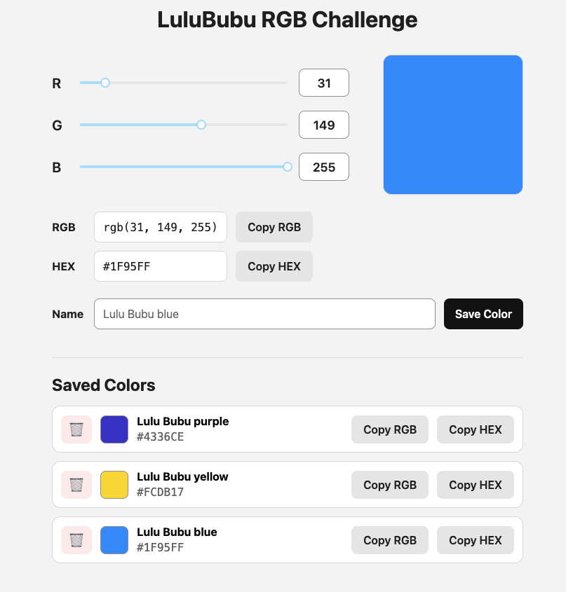

# LuluBubu RGB Challenge

A small full-stack RGB color picker built with **React**, **PHP** and **MySQL**.

The application allows users to create RGB colors, preview them in real time, convert them to HEX values and store custom named colors in a MySQL database.

---

## 📸 Screenshot



---

## ✨ Features

- 🎨 Live RGB color preview
- 🎚️ Three RGB sliders (Red, Green, Blue)
- 🔢 Automatic HEX color conversion
- 📋 Copy RGB value to clipboard
- 📋 Copy HEX value to clipboard
- 💾 Save named colors
- 🗂 Persist colors in a MySQL database
- 🎯 Select saved colors
- 🗑 Delete saved colors
- 📱 Responsive layout for desktop and mobile devices

---

## 🛠 Tech Stack

### Frontend

- React
- Vite
- JavaScript (ES6+)
- CSS
- rc-component Slider

### Backend

- PHP 8
- MySQL

---

## 📁 Project Structure

```
.
├── assets/
│   └── screenshot.png
│
├── database/
│   └── schema.sql
│
├── server/
│   ├── config/
│   │   └── db.php
│   ├── routes/
│   │   └── colors.php
│   └── index.php
│
├── src/
│   ├── components/
│   │   ├── ColorActions/
│   │   ├── ColorPreview/
│   │   ├── ColorSlider/
│   │   └── SavedColors/
│   ├── App.jsx
│   └── index.css
│
├── package.json
└── README.md
```

---

## 🚀 Getting Started

### 1. Clone the repository

```bash
git clone <repository-url>
```

```bash
cd lulububu-rgb-challenge
```

---

### 2. Install frontend dependencies

```bash
npm install
```

---

### 3. Create the database

Import the SQL schema:

```bash
mysql -u root < database/schema.sql
```

This creates:

- Database: `lulububu_rgb_challenge`
- Table: `colors`

---

### 4. Configure the database connection

Open:

```
server/config/db.php
```

Adjust your MySQL credentials if necessary.

Example:

```php
$host = "localhost";
$dbname = "lulububu_rgb_challenge";
$username = "root";
$password = "";
```

---

### 5. Start the PHP backend

```bash
php -S localhost:8000 -t server
```

The API will be available at:

```
http://localhost:8000/colors
```

---

### 6. Start the React frontend

```bash
npm run dev
```

Open:

```
http://localhost:5173
```

---

## 📡 API Endpoints

| Method | Endpoint      | Description          |
| ------ | ------------- | -------------------- |
| GET    | `/colors`     | Get all saved colors |
| POST   | `/colors`     | Save a new color     |
| DELETE | `/colors/:id` | Delete a saved color |

---

## 💾 Database

The project uses a single MySQL table.

| Column      | Description           |
| ----------- | --------------------- |
| id          | Primary key           |
| name        | Color name            |
| red_value   | Red channel (0–255)   |
| green_value | Green channel (0–255) |
| blue_value  | Blue channel (0–255)  |
| created_at  | Timestamp             |

---

## 💡 Possible Future Improvements

- SVG logo color editor
- Search saved colors
- Color sorting
- Edit existing colors
- Dark mode
- Export / Import color palettes

---

## 👨‍💻 Author

Created by **Jeff Braun** as part of the LuluBubu RGB Challenge.